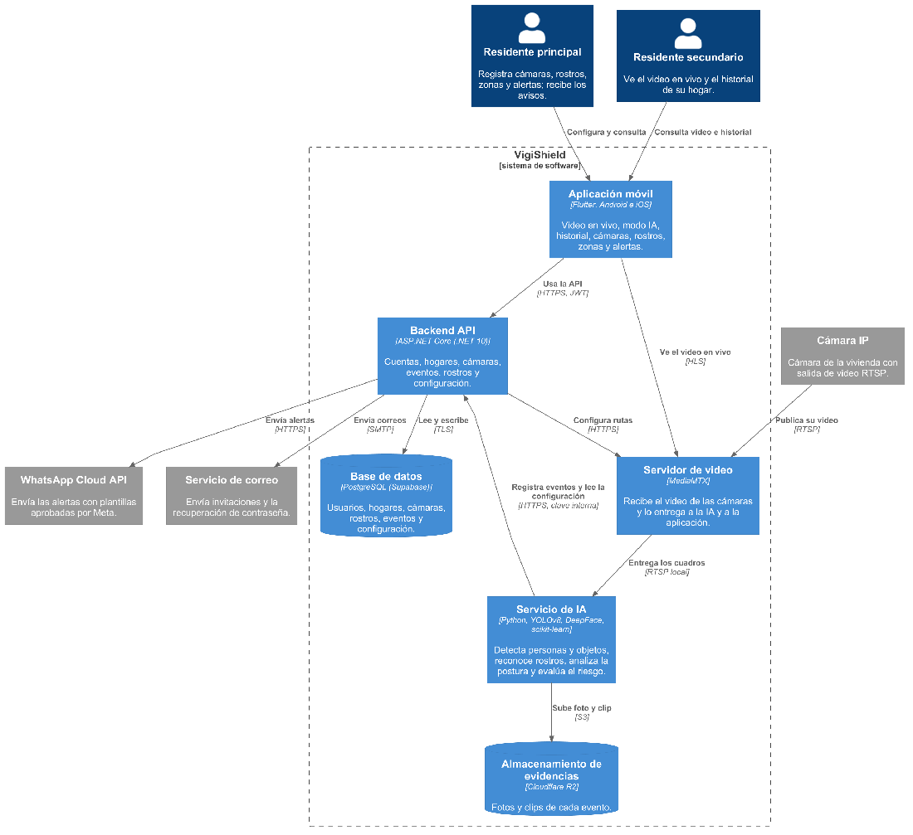
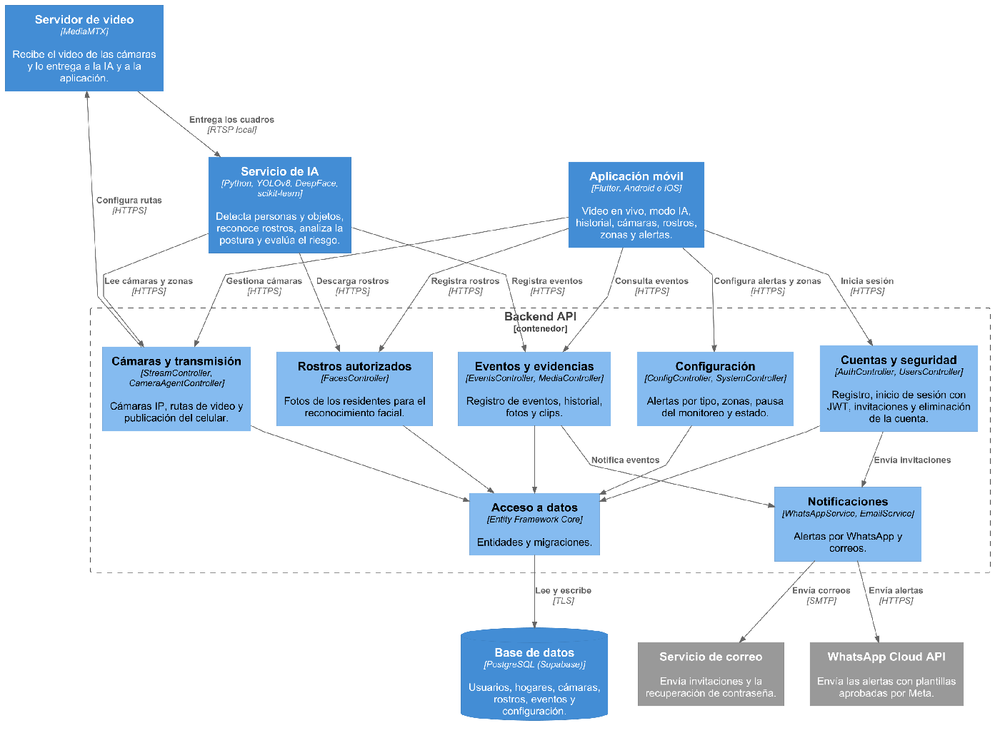
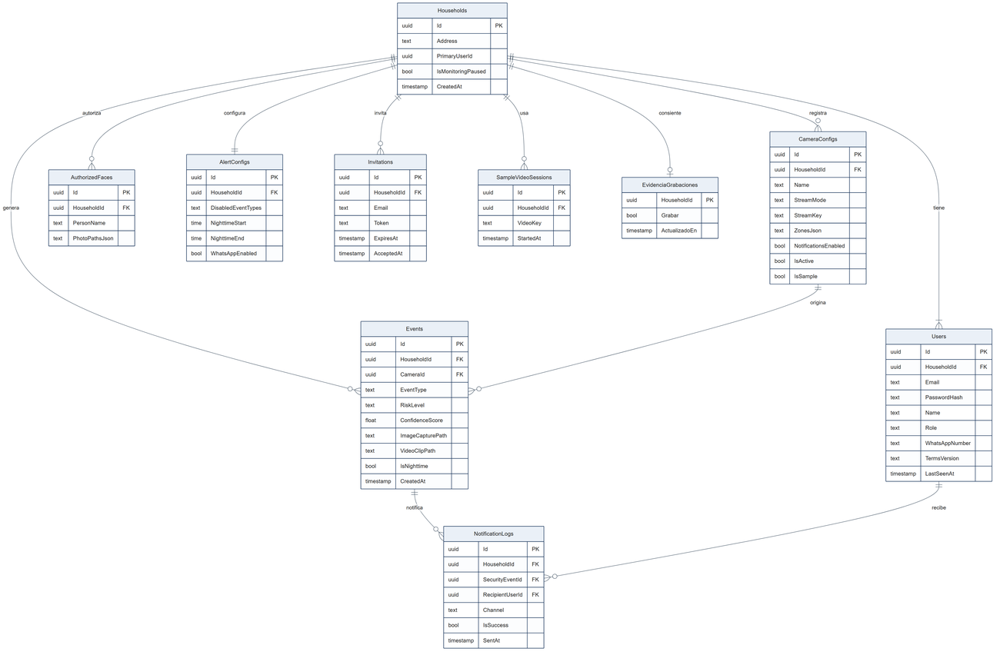

# VigiShield — backend

API REST de **VigiShield**, un sistema de seguridad para viviendas con cámaras e inteligencia artificial.
Guarda las cuentas, los hogares, las cámaras, los rostros autorizados y los eventos; recibe los eventos del
[servicio de IA](https://github.com/TP202610071/VigiShield-AI-Backend) y avisa a los residentes en la
[app](https://github.com/TP202610071/VigiShield-MobileApp) y por WhatsApp.

Proyecto de tesis de Ingeniería de Software (UPC, 2026).

## Arquitectura

<p align="center"></p>

Dentro de la API, cada grupo de controladores atiende una parte del dominio:

<p align="center"></p>

El código sigue capas simples: `Controllers` → `Application/Services` → `Infrastructure` (EF Core, correo,
WhatsApp, R2, MediaMTX) y `Domain/Entities`.

## Modelo de datos

PostgreSQL (Supabase) con Entity Framework Core. Cada hogar tiene un residente principal, sus residentes
invitados, sus cámaras, sus rostros autorizados y sus eventos.

<p align="center"></p>

## API

| Ruta | Para qué |
|---|---|
| `/api/auth` | Registro, inicio de sesión (JWT), perfil, términos, recuperación de contraseña y eliminación de cuenta |
| `/api/users` | Invitaciones y residentes del hogar |
| `/api/stream` | Cámaras, zonas, rutas de video, celular como cámara (WHIP) y video de ejemplo |
| `/api/faces` | Rostros autorizados |
| `/api/events` | Historial, detalle y borrado de eventos; ingreso de eventos de la IA |
| `/api/config`, `/api/system` | Alertas por tipo, pausa del monitoreo y estado |
| `/api/media` | Capturas de pantalla desde la app |
| `/api/agent` | Órdenes para el agente que ajusta la imagen de la cámara desde la red de la casa |

La documentación interactiva (Scalar) se publica en `/scalar` en desarrollo.

**Autenticación.** La app usa un JWT. El servicio de IA usa una clave interna (`X-Api-Key`) solo en las
rutas que necesita: ingresar eventos, adjuntar clips y leer cámaras, zonas, rostros y configuración.

**Alertas.** Cada evento que el hogar tiene activado se envía por WhatsApp Cloud API con una plantilla aprobada
por Meta y un enlace que abre el evento en la app. Si se configura una plantilla con imagen, el mensaje lleva la
foto del evento; si falla, se envía la de texto.

**Borrado.** Eliminar la cuenta del residente principal borra el hogar completo: base de datos y fotos y clips
en Cloudflare R2, incluidos los recortes de rostro de cada evento.

## Configuración

Los valores reales van en variables de entorno (`Seccion__Clave`), nunca en el repositorio. `appsettings.json`
solo trae valores de ejemplo.

| Sección | Para qué |
|---|---|
| `ConnectionStrings:Default` | PostgreSQL |
| `Jwt` (`Secret`, `Issuer`, `Audience`, `ExpiryDays`) | Tokens de la app |
| `InternalApi:Key` | Clave del servicio de IA |
| `MediaMtx` | Servidor de video: host, puertos, API y URL de HLS/WHIP |
| `R2` (`Endpoint`, `Bucket`, `AccessKeyId`, `SecretAccessKey`, `PublicBaseUrl`) | Fotos y clips |
| `WhatsApp` (`AccessToken`, `PhoneNumberId`, `EventTemplate`, `EventImageTemplate`…) | Alertas |
| `Email` (`SmtpHost`, `Username`, `Password`…) | Invitaciones y recuperación de contraseña |

## Ejecutar

Requiere el SDK de .NET 10 y una base PostgreSQL.

```bash
dotnet restore
dotnet ef database update --project VigiShield_Main_Backend      # migraciones
dotnet run --project VigiShield_Main_Backend
dotnet test VigiShield.Tests                                      # pruebas
```

En producción corre como servicio `systemd` detrás de nginx (HTTPS) en una máquina virtual de Oracle Cloud.
Se publica con `dotnet publish -c Release -r linux-x64 --self-contained false` y el despliegue reemplaza la
versión de forma atómica: si el servicio no responde en `/health`, vuelve a la anterior.

La carpeta `web/` tiene el sitio público (inicio, términos, privacidad y restablecimiento de contraseña) y
`app-version.json`, con el build mínimo y el último de la app en iOS: la app lo lee para pedir actualizar.
